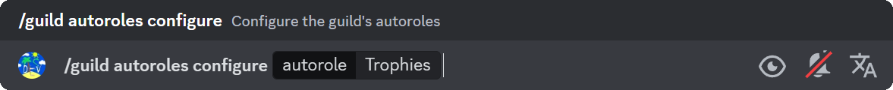
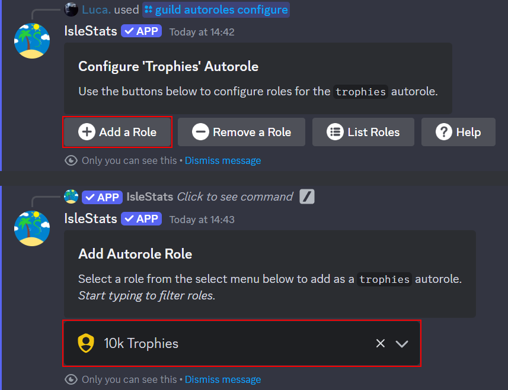
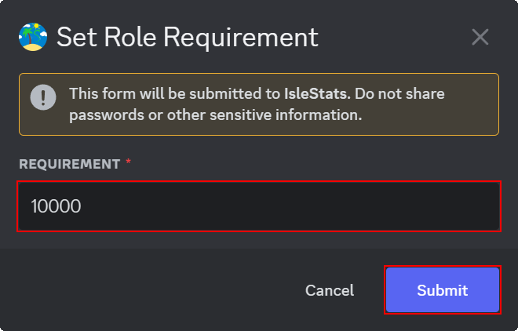
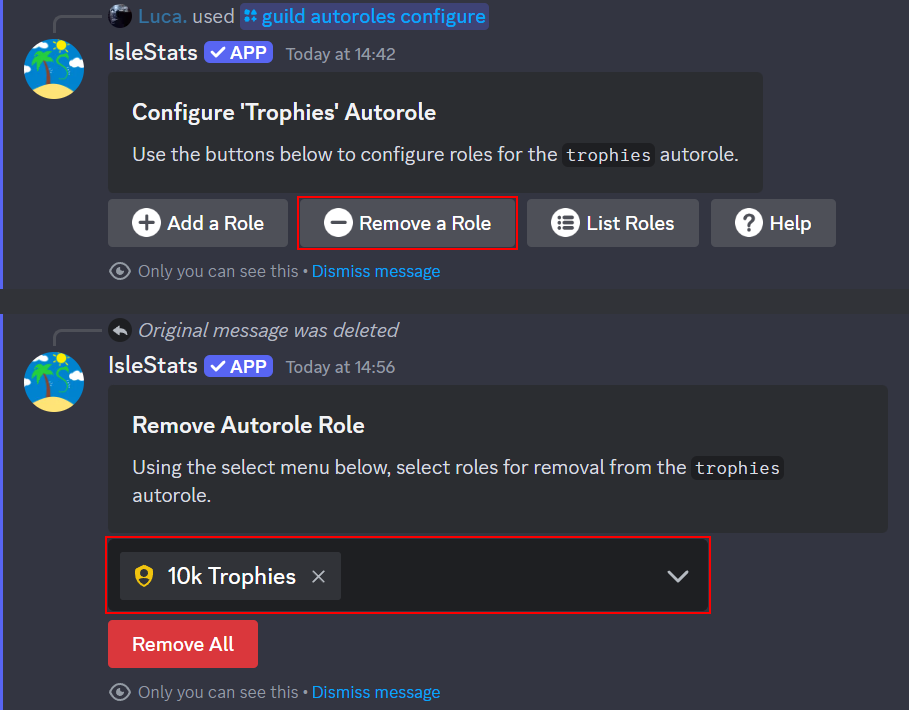
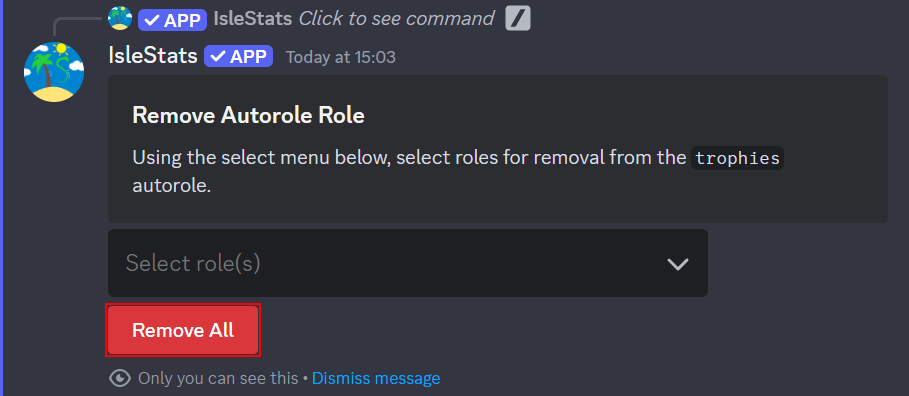

# Configure Autoroles

### Requirements

- To configure autoroles for a guild, you as a user require one (or more) of the following permissions:
  - `Administrator`
  - `Manage Guild`
  - `Manage Roles`
- In order for autoroles to work, the bot requires the `Manage Roles` permission.

**There are two aspects to an autorole role; the associated Discord role, and the requirement for obtaining it.** This for example could be an `@10k Trophies` with the requirement of `10,000` MCC Island trophies.

## Adding Autorole Roles

1. Run the IsleStats `/guild autoroles configure` command, selecting the autorole you would like to configure.

   

2. Press the **Add a Role** button and select your desired role from the dropdown.

   

3. Set a requirement for obtaining the role by entering a valid number into the modal that appears.

   

You should now see a success message confirming that the selected role has been added to your chosen autorole group.

:::note[]
To add a Discord role to an autorole, the role must be assignable by the IsleStats bot and not have the `Administrator` permission.
:::

## Removing Autorole Roles

1. Run the IsleStats `/guild autoroles configure` command, selecting the autorole you would like to configure.

   

2. Press the **Remove a Role** button and from the dropdown, select the role(s) you would like to remove from the autorole group.

   

   Alternatively, you can press the **Remove All** button to remove all roles from your selected autorole group.

   

You should now see a success message confirming that the role(s) have been removed from your selected autorole group.
