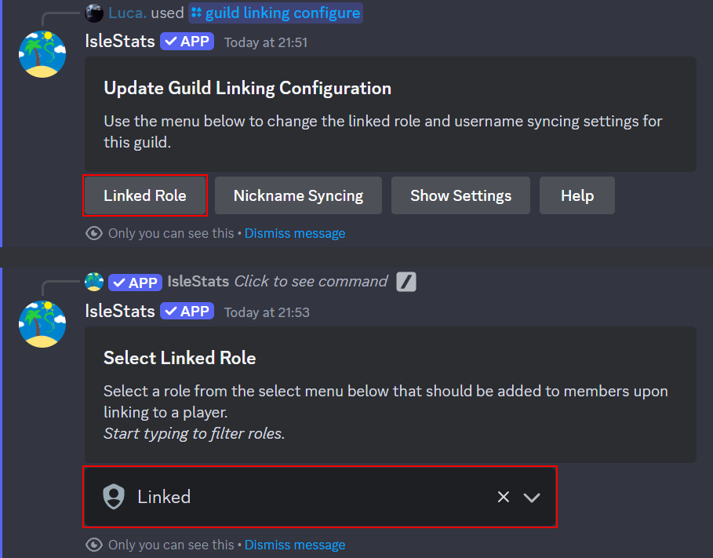
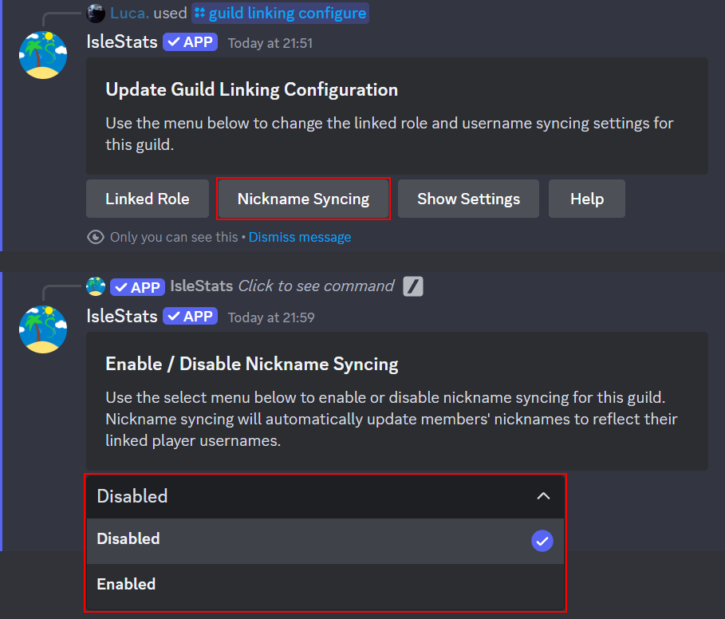

# Configure Guild Linking

Guild linking allows you to create a linked role for your guild as well as enable nickname syncing.

- A linked role will be added to members that link their Discord account to a player with IsleStats (see [Link your account](/user-guides/link-your-account)).
- When enabled, nickname syncing will update members' nicknames to reflect the username of the player that they are linked to.

### Requirements

- To configure the linked role for a guild, you as a user require one (or more) of the following permissions:
  - `Administrator`
  - `Manage Guild`
  - `Manage Roles`
- To enable / disable nickname syncing for a guild, you as a user require the `Manage Nicknames` permission.
- In order for the linked role to work, the bot requires the `Manage Roles` permission.
- In order for nickname syncing to work, the bot requires the `Manage Nicknames` permission.

## Configure Linked Role

### Set linked role

1. Run the IsleStats `/guild linking configure` command.

   

2. Press the **Linked Role** button and select the role you would like to set as the linked role from the dropdown.

   

You should now see a success message confirming that the selected role has been set as the linked role.

:::note[]
To set a Discord role to the linked role, the role must be assignable by the IsleStats bot and not have the `Administrator` permission.
:::

### Remove linked role

Coming soon...

<!-- TODO -->

## Toggle Nickname Syncing On / Off

1. Run the IsleStats `/guild linking configure` command.

   

2. Press the **Nickname Syncing** button and select either _Enabled_ or _Disabled_ from the dropdown.

   

You should now see a success message confirming that nickname syncing has been enabled / disabled.
