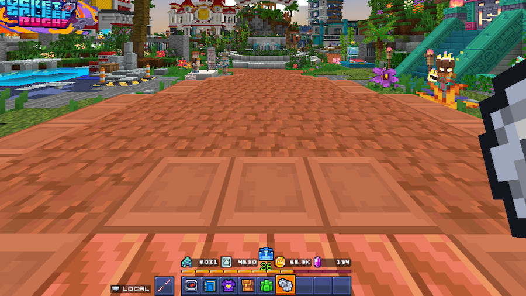
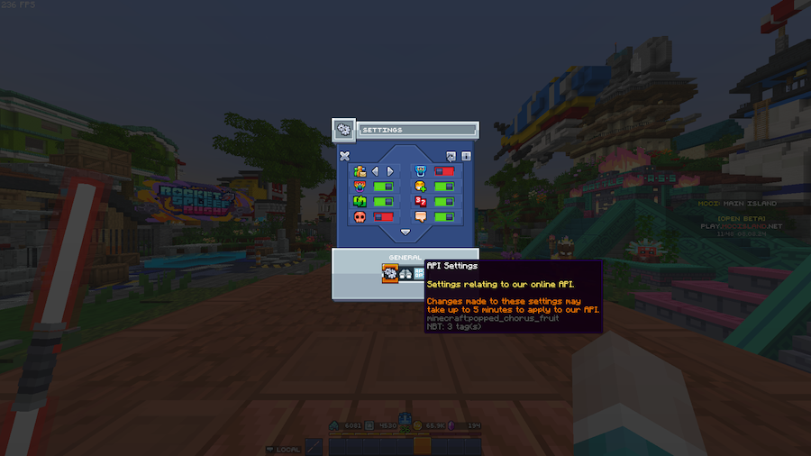

# Enable the MCC Island API

A majority of commands require the MCC Island API to be enabled in game.

### Requirements

- Any **Minecraft (Java Edition)** supported by MCC Island
  - This has to be a legal (not cracked) copy of the game!

## Enable

Launch Minecraft (Java Edition) with any version no later than 1.20.6.

Connect to MCC Island.

Navigate to the settings menu in your hotbar.

 <!-- TODO: insert image -->

Navigate to the API settings tab in the settings menu.

 <!-- TODO: insert image -->

Toggle the API settings to your liking or enable all for the full IsleStats experience
