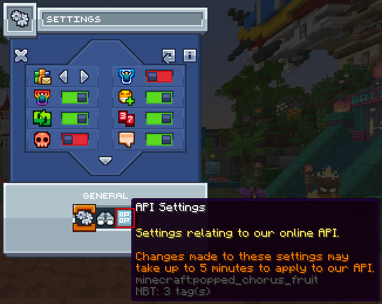

# Enable the MCC Island API

A majority of commands require the MCC Island API to be enabled in game.

### Requirements

- Any **Minecraft (Java Edition)** supported by MCC Island
  - This has to be a legal (not cracked) copy of the game!

## Enable

1. Launch Minecraft (Java Edition) with any version no later than 1.20.6.

2. Connect to MCC Island.

3. Navigate to the settings menu in your hotbar.

   

4. Navigate to the API settings tab in the settings menu.

   

5. Toggle the API settings to your liking or enable all for the best IsleStats experience
