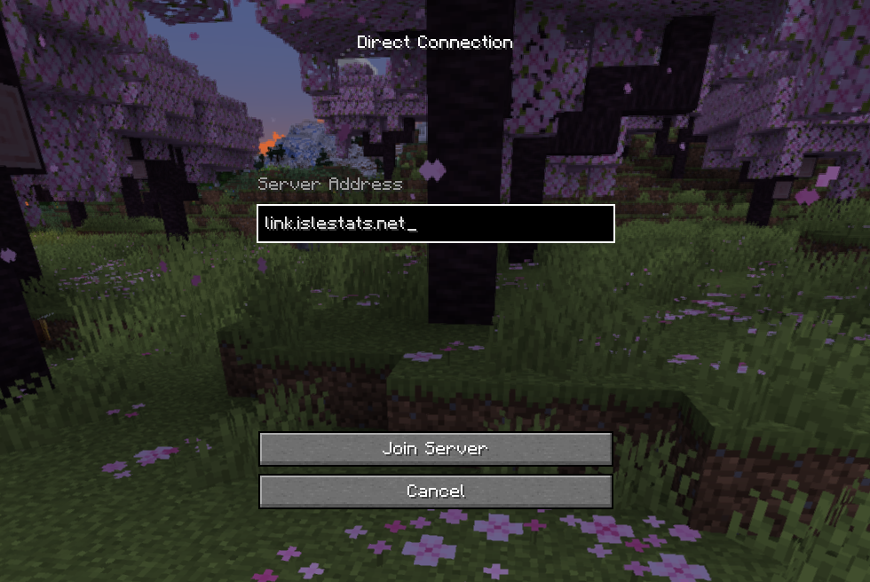
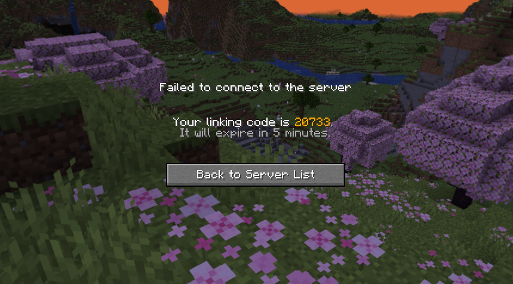
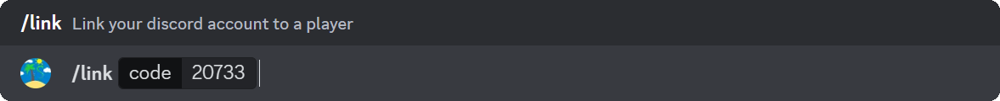

# Link Your Account

Linking your account allows you to quickly run commands that usually need a username as input. The bot automatically 'fills' out the input when your account is linked.

On top of that, linking your account also allows you to recieve guild roles automatically when in guilds that have configured it!

### Requirements

- Any version of **Minecraft (Java Edition)**
  - This has to be a legal (not cracked) copy of the game!
- A **discord account** with access to IsleStats

## Obtain a linking code

1. Launch Minecraft (Java Edition) with any version no later than 1.20.6.

2. Connect to the minecraft server `link.islestats.net`. The server will immediately kick you, this is normal.

   

3. A valid code should be shown which you should take note off. This code expires in 5 minutes.

   

:::warning

Revealing this code allows anybody to link your Minecraft account to their Discord account.
It will invalidate itself after linking, so do not worry if the command exposes your code.

:::

## Link your discord account

1. Run the IsleStats `/link` command and input your code.

   

2. The bot will process the code and should return a render with your minecraft player.

   

Once you see this, your account has been linked!

## Unlink your account

To unlink your account, please contact us in the [support server](https://islestats.net/discord)!
